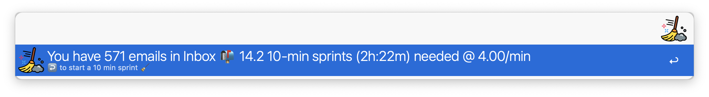

# email-sweeper (or alfred-emailstrom)
email sweep assistant

- start 'email sprints'
- record email sweep rate over time
- estimate number of sprints and time needed to clear your inbox
- a report is copied to the clipboard in markdown format
- optional for [Complice](https://complice.co/) users: record email sprints in your complice account
- set in `Workflow Configuration`:
	- keyword or hotkey to launch the workflow
	- email folder to watch
	- length of sprints
	- complice-related stuff

- [menubar countdown](https://github.com/kristopherjohnson/MenubarCountdown) needed to show a counter in the menubar. 
	- `brew install --cask menubar-countdown` to install

# Thank you
- menubar countdown
- icon: https://www.flaticon.com/free-icon/broom_2954888
